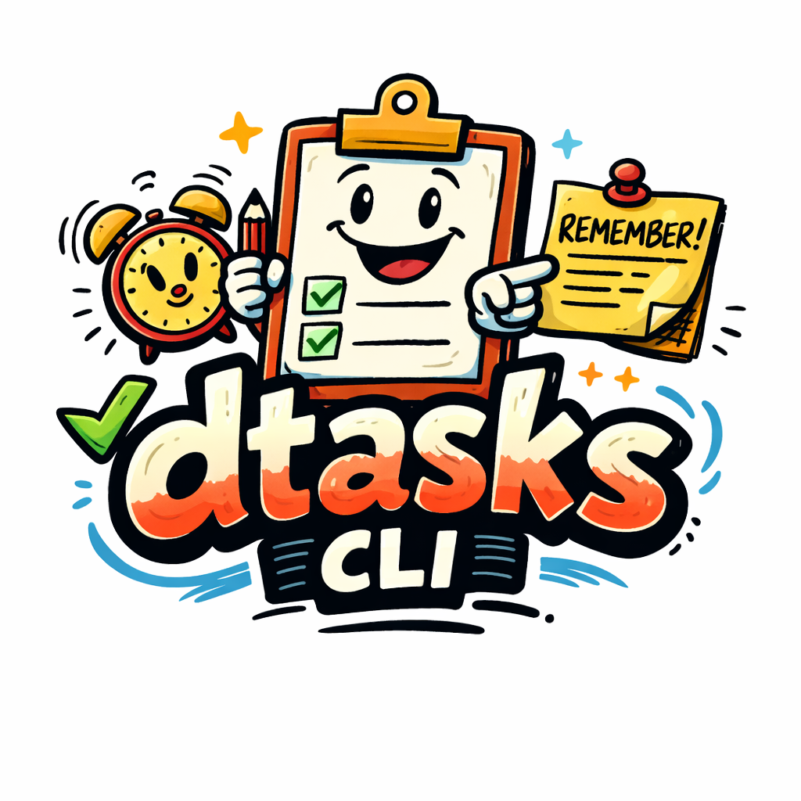

# dtasks

<p align="center">
  
</p>

[](https://github.com/danielmrdev/dtasks-cli/actions/workflows/ci.yml)
[](https://github.com/danielmrdev/dtasks-cli/releases/latest)
[](https://go.dev)
[](#install)
[](LICENSE)

A fast, scriptable CLI task manager. Single static binary — no runtime dependencies, no daemon, no sync service.

Tasks and lists live in a local SQLite database. Point the database path to a shared folder (Dropbox, Google Drive, iCloud Drive, Syncthing…) to keep your tasks in sync across machines.

## Install

**macOS / Linux — install script**

```bash
curl -fsSL https://raw.githubusercontent.com/danielmrdev/dtasks-cli/main/install.sh | sh
```

Detects your OS and architecture, downloads the correct binary, verifies the SHA-256 checksum, and installs to `/usr/local/bin` (or `~/.local/bin` if you don't have write access).

**Windows — install script (PowerShell)**

```powershell
irm https://raw.githubusercontent.com/danielmrdev/dtasks-cli/main/install.ps1 | iex
```

Installs to `%LOCALAPPDATA%\Programs\dtasks` and adds it to your user `PATH` automatically. No admin required.

**Manual download**

Download the latest binary for your platform from the [Releases](https://github.com/danielmrdev/dtasks-cli/releases/latest) page:

| Platform | File |
|----------|------|
| macOS Apple Silicon | `dtasks-macos-arm64` |
| macOS Intel | `dtasks-macos-amd64` |
| Linux x86-64 | `dtasks-linux-amd64` |
| Linux ARM64 | `dtasks-linux-arm64` |
| Windows x86-64 | `dtasks-windows-amd64.exe` |
| Windows ARM64 | `dtasks-windows-arm64.exe` |

Each release includes a `checksums.txt` file with SHA-256 hashes. Place the binary somewhere in your `PATH` and run it from your terminal or PowerShell.

## Build from source

Requires Go 1.22+.

```bash
git clone https://github.com/danielmrdev/dtasks-cli
cd dtasks
go mod tidy
go build -o dtasks .
```

Build all release targets at once:

```bash
make build        # native binary → dist/dtasks
make install      # build + copy to ~/.local/bin
make build-all    # all platforms → dist/
make help         # list all targets
```

## First run

On first run, dtasks asks where to store the database and writes a config file:

| Platform | Config file |
|----------|-------------|
| macOS | `~/.dtasks/.env` |
| Linux | `~/.config/dtasks/.env` (respects `$XDG_CONFIG_HOME`) |
| Windows | `%AppData%\dtasks\.env` |

```
$ dtasks ls
Welcome to dtasks! No configuration found.

Database path [~/.local/share/dtasks/tasks.db]:
```

Press Enter to accept the default or type a custom path. The database is created automatically.

To skip the wizard, pass `--db` or set `DB_PATH` in the config file:

```bash
dtasks --db /path/to/tasks.db ls
```

## Usage

### Lists

```bash
dtasks list create "Personal"
dtasks list ls
dtasks list rename 1 "Home"
dtasks list rm 1
```

### Tasks

```bash
# Create
dtasks add --list 1 "Buy milk"
dtasks add --list 1 "Buy milk" --due 2026-03-01 --due-time 10:00 --notes "organic"
dtasks add --list 1 --parent 5 "Subtask title"
dtasks add --list 1 "Weekly review" --due 2026-03-07 --autocomplete   # auto-completes when due

# Read
dtasks ls                    # pending tasks
dtasks ls --list 1           # filter by list
dtasks ls --due-today        # due today or overdue
dtasks ls --all              # include completed
dtasks show 42               # full detail + subtasks

# Update
dtasks edit 42 --title "New title"
dtasks edit 42 --due 2026-04-01 --due-time 17:00 --notes "updated"
dtasks edit 42 --autocomplete          # toggle autocomplete on an existing task
dtasks done 42                         # marks done; if recurring, schedules next occurrence
dtasks undone 42

# Delete
dtasks rm 42
```

### Recurrence

```bash
dtasks recur daily 42 --every 1
dtasks recur weekly 42 --every 2 --day thu --ends-after 30
dtasks recur monthly 42 --every 1 --day 25 --ends never
dtasks recur monthly 42 --every 3 --day 1 --ends 2027-01-01
dtasks recur rm 42
```

When you run `dtasks done` on a recurring task, the next occurrence is created automatically and printed. The new task inherits the title, notes, `due_time`, recurrence settings, and `--autocomplete` flag.

### Autocomplete

Tasks with `--autocomplete` are completed automatically the next time any dtasks command runs, once their `due_date` has passed. Useful for recurring reminders that don't need manual action:

```bash
dtasks add --list 1 "Weekly review" --due 2026-03-07 --due-time 09:00 --autocomplete
dtasks recur weekly 42 --every 1 --day fri
# Every Friday: the task auto-completes and a new one is created for next week with the same time
```

### JSON output

All commands support `--json` for scripting and integration with other tools:

```bash
dtasks ls --json
dtasks show 42 --json
dtasks list ls --json
```

## Shared database

Point `DB_PATH` to a folder synced by Dropbox, Google Drive, iCloud Drive, Syncthing, or any other file-sync service and dtasks will use the same database on every machine:

```bash
# ~/.config/dtasks/.env (Linux) or ~/.dtasks/.env (macOS)
DB_PATH=/path/to/your/synced/folder/tasks.db
```

Or pass it inline for a one-off:

```bash
dtasks --db ~/Dropbox/tasks.db ls
```

The database uses WAL mode and a 5-second busy timeout to handle concurrent access safely.

## Global flags

| Flag | Description |
|------|-------------|
| `--db PATH` | Override the database path from config |
| `--json` | Output as JSON |
| `--version` | Print version and exit |

## License

MIT
